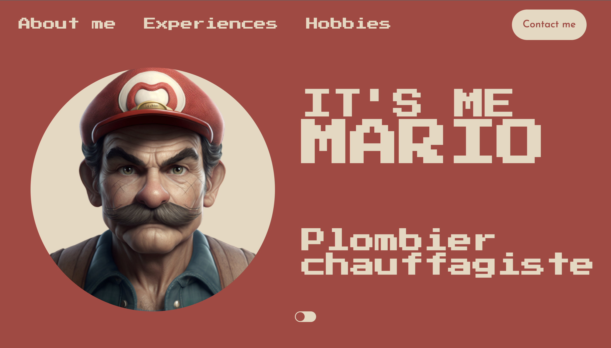

<h1>Web Developer</h1>

## About Me

Hello and welcome to my GitHub profile! My name is Saverio Cutolo aka <b>Sashiki05</b> I'm currently on a journey to pursue my passion for tech as a web developer, and I'm excited to share my progress with you.

I am transitioning into a career as a web developer after working as a manager in fast food. I want to turn my passion into my profession.

As part of my training at the Wild Code School, I've already completed some exciting projects that I'm proud to share with you :
  - First project was a fictive CV for Mario. It was a fun challenge to bring a beloved video game character to life in a professional setting.

  Technology used: 
  
  

  - Second project was a NASA app that involved fetching APIs. we worked for the first time with scrum methods and sprints for each features. It was a great opportunity to combine my passion for the "space world" with my newfound love for tech. "I am very happy that this app can be a point of reference for all the space fans (specifically NASA fans) like me."

Technology used: 	
  
  

## Project Showcase

### Project 1: Mario CV in CSS/HTML and JS

Description: This is a fictive CV for Mario created with CSS, HTML, and JS for my Wild Code School Project 1.

GitHub repository link: [https://github.com/Sashiki05/mario-cv](https://github.com/Sashiki05/mario-cv) SOON

Live demo link: [https://Sashiki05.github.io/mario-cv/](https://Sashiki05.github.io/mario-cv/) SOON

Screenshot:
 SOON

### Project 2: NASA App with React, Node, HTML, CSS, and JS

Description: This is a NASA app that fetches data from an API and allows users to: have all the latest news in real-time, a searchable database of images, a miniature of our solar system, and a GPS tracker of the ISS (International Space Station).

. Created with React, Node, HTML, CSS, and JS for my Wild Code School Project 2.

GitHub repository link: [https://github.com/Sashiki05/NASA-concept-APP](https://github.com/Sashiki05/NASA-concept-APP) SOON

Live demo link: [https://Sashiki05.github.io/NASA-concept-APP/](https://Sashiki05.github.io/NASA-concept-APP/) SOON

Screenshot:
 SOON

Currently, I'm still in the process of completing my Fullstack web developer training, with a focus on Javascript, React, NodeJS, mySQL, and Express. I'm eager to apply my experience and knowledge to my future career in tech.

As I move forward, I'm actively seeking an apprenticeship in a professional contract starting from September 2023. I'm excited to continue learning and growing as a developer, and I can't wait to see where this journey takes me.

Thank you for taking the time to read about me, and feel free to browse through my projects and contributions on GitHub. Let's connect and collaborate to make great things happen!

Click here to add me on 
